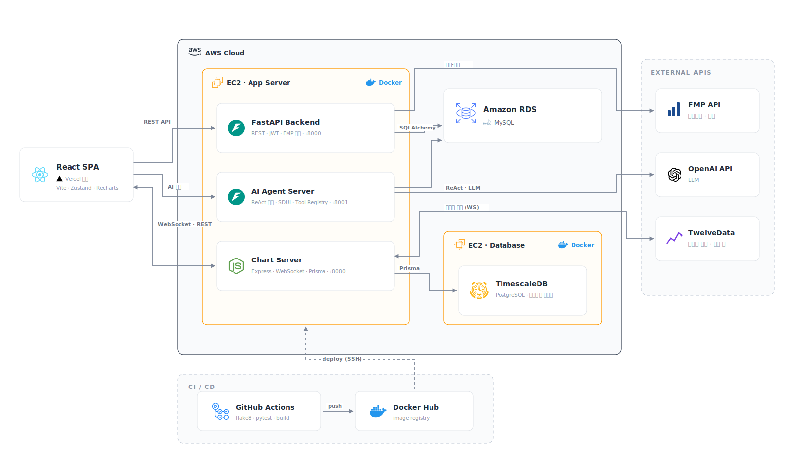

# Fin:D

Fin:D는 금융 뉴스, 기업 정보, 실시간 시장 데이터를 통합해 투자 판단에 필요한 정보를 제공하는 금융 데이터 분석 서비스입니다.

사용자는 대시보드와 기업 상세 화면에서 재무·뉴스·차트 데이터를 확인하고, 팀에서 구현한 AI 질의응답 기능으로 기업과 시장 데이터를 탐색할 수 있습니다.

## 전체 아키텍처

| Module | Role | 주요 기술 | 담당 |
| --- | --- | --- | --- |
| `find-front_T` | 대시보드, 기업 상세, 차트, AI 질의응답 UI | React, TypeScript, Vite | Team |
| `find-backend_T` | 인증, 재무·뉴스 데이터 API, AI 질의응답 연동 | FastAPI, SQLAlchemy, MySQL/RDS | Team |
| `find-chart_T` | 실시간 가격 수신, 캔들 저장·조회, 실시간 차트 데이터 제공 | Node.js, TypeScript, TimescaleDB | @asd1702 |

## 주요 기능

- 기업 프로필, 재무제표, 주요 지표와 뉴스 조회
- 사용자 즐겨찾기와 일정 관리
- AI 질의응답을 통한 기업·시장 데이터 탐색
- 실시간 가격과 1분봉 OHLCV 캔들 제공
- TimescaleDB Continuous Aggregates 기반 다중 timeframe 조회

## My Contribution - Chart Server

- TwelveData WebSocket 기반 실시간 가격 데이터 수신
- tick 데이터를 1분봉 OHLCV candle로 변환하고 buffer로 batch 저장
- TimescaleDB와 Continuous Aggregates 기반 `1m`~`1M` 조회 구조 구성
- REST Candle API와 WebSocket tick/candle 데이터 제공
- WebSocket을 client별 symbol subscription 구조로 개선하고 heartbeat cleanup 추가
- API validation, 공통 실패 응답, DB destructive script guard 보강
- Vitest, strict typecheck, multi-stage Docker, dependency audit, GitHub Actions CI 구성

자세한 담당 범위와 설계 판단은 [Chart Server Contribution](docs/chart/CONTRIBUTION.md)에 정리했습니다.

## 품질 검증

| 항목 | 결과 |
| --- | --- |
| Automated tests | 6 files, 63 tests passed |
| TypeScript | strict typecheck passed |
| Dependency audit | 전체/production 0 vulnerabilities |
| Build | TypeScript 및 production Docker build passed |
| Local DB | TimescaleDB health, Prisma migration, Continuous Aggregates 검증 |
| CI | GitHub Actions Chart Server workflow passed |

## Tech Stack

| 영역 | 기술 |
| --- | --- |
| Frontend | React, TypeScript, Vite, React Query, Zustand |
| Backend / Agent API | Python, FastAPI, SQLAlchemy, MySQL/RDS, OpenAI SDK |
| Chart Server | Node.js, TypeScript, Express, ws, Prisma |
| Time-Series DB | PostgreSQL, TimescaleDB, Continuous Aggregates |
| Infra / Quality | Docker, Docker Compose, Vitest, GitHub Actions |

## 실행

각 모듈은 독립적으로 실행됩니다. Chart Server의 로컬 실행과 환경 구성은 [Chart Server README](find-chart_T/README.md)를 참고하세요.

## Documentation

| 문서 | 내용 |
| --- | --- |
| [Chart Server Contribution](docs/chart/CONTRIBUTION.md) | 개인 담당 범위, 설계 판단, 개선 과정과 한계 |
| [Chart Server README](find-chart_T/README.md) | 실행, 테스트, Docker, CI |
| [Chart API Documentation](find-chart_T/docs/API_DOCUMENTATION.md) | 실제 등록 REST API와 WebSocket protocol |
| [DB Setup](find-chart_T/docs/DB_SETUP.md) | Local TimescaleDB, migration, DB 안전장치 |
| [Dependency Audit](find-chart_T/docs/DEPENDENCY_AUDIT.md) | 취약점 분류와 업데이트 판단 |
| [Docker](find-chart_T/docs/DOCKER.md) | Multi-stage production image와 smoke test |
