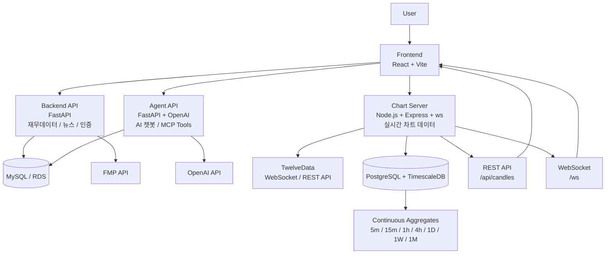

# Fin:D

기업 재무데이터, 뉴스, 실시간 시장 데이터, AI 질의응답을 결합한 금융 분석 서비스입니다.

사용자는 대시보드와 기업 상세 화면에서 재무 정보와 차트 데이터를 확인하고, AI 챗봇을 통해 투자 관련 질문에 대한 데이터 기반 응답을 받을 수 있습니다.

> 팀 프로젝트 · 금융 데이터 분석 서비스 · Frontend / Backend API / Agent API / Chart Server 모노레포

---

## 서비스 개요

Fin:D는 금융 데이터를 다양한 관점에서 조회하고 분석할 수 있도록 구성된 서비스입니다.

- **Frontend**: 대시보드, 기업 상세, 차트, AI 챗봇 UI 제공
- **Backend API**: 인증, 기업 재무데이터, 뉴스, 사용자 데이터 처리
- **Agent API**: AI 챗봇과 MCP-style tool registry 기반 데이터 조회
- **Chart Server**: 실시간 시장 데이터 수신, 캔들 생성, 차트 API/WebSocket 제공

---

## 전체 아키텍처

---

## 서비스 구성

| 모듈 | 역할 | 주요 기술 | 담당 |
| --- | --- | --- | --- |
| `find-front_T` | 대시보드, 기업 상세, 차트, AI 챗봇 UI | React, TypeScript, Vite | 팀 |
| `find-backend_T` | 인증, 기업 재무데이터, 뉴스, 사용자 데이터 API | FastAPI, SQLAlchemy, MySQL/RDS | 팀 |
| `find-backend_T` Agent | AI 챗봇, MCP-style tool 기반 데이터 조회 | FastAPI, OpenAI SDK | 팀 |
| `find-chart_T` | 실시간 가격 수신, 캔들 생성, 차트 API/WebSocket 제공 | Node.js, TypeScript, TimescaleDB | @asd1702 |

---

## 주요 기능

### 금융 데이터 조회

- 기업 프로필 조회
- 재무제표 조회
- 주요 지표 조회
- 뉴스 조회
- 사용자 즐겨찾기 및 일정 관리

### AI 질의응답

- 사용자의 투자 관련 질문 처리
- 등록된 도구를 활용한 기업/시장 데이터 조회
- 데이터 기반 응답 및 위젯 렌더링 지원

### 실시간 차트 데이터

- TwelveData 기반 실시간 가격 데이터 수신
- tick 데이터를 1분봉 OHLCV 캔들로 변환
- TimescaleDB 기반 시계열 데이터 저장
- Continuous Aggregates 기반 상위 타임프레임 조회
- REST API와 WebSocket을 통한 프론트엔드 차트 데이터 제공

---

## Tech Stack

| 영역 | 기술 |
| --- | --- |
| Frontend | React, TypeScript, Vite, React Query, Zustand |
| Backend API | Python, FastAPI, SQLAlchemy, MySQL/RDS |
| Agent API | FastAPI, OpenAI SDK, MCP-style tool registry |
| Chart Server | Node.js, TypeScript, Express, ws, Prisma |
| Time-Series DB | PostgreSQL, TimescaleDB, Continuous Aggregates |
| External APIs | FMP, TwelveData, OpenAI |
| Infra | Docker, docker-compose |

---

## 실행 방법

각 모듈은 독립적으로 실행됩니다.

| 모듈 | 진입점 | 기본 포트 |
| --- | --- | --- |
| Frontend | `find-front_T` | Vite dev server |
| Backend API | `find-backend_T/main.py` | 8000 |
| Agent API | `find-backend_T/agent_main.py` | 8001 |
| Chart Server | `find-chart_T/src/server.ts` | 8080 |

상세 실행 방법과 환경변수는 각 모듈 문서를 기준으로 확인합니다.

---

## Documentation

| 문서 | 내용 |
| --- | --- |
| [Chart Server 기여 문서](docs/chart/CONTRIBUTION.md) | Chart Server 담당 범위, 설계 의사결정, 한계와 개선 방향 |
| [Chart Server README](find-chart_T/README.md) | Chart Server 실행 방법, 환경변수, API |
| [Chart API 문서](find-chart_T/docs/API_DOCUMENTATION.md) | Chart Server 실제 API 명세 |
