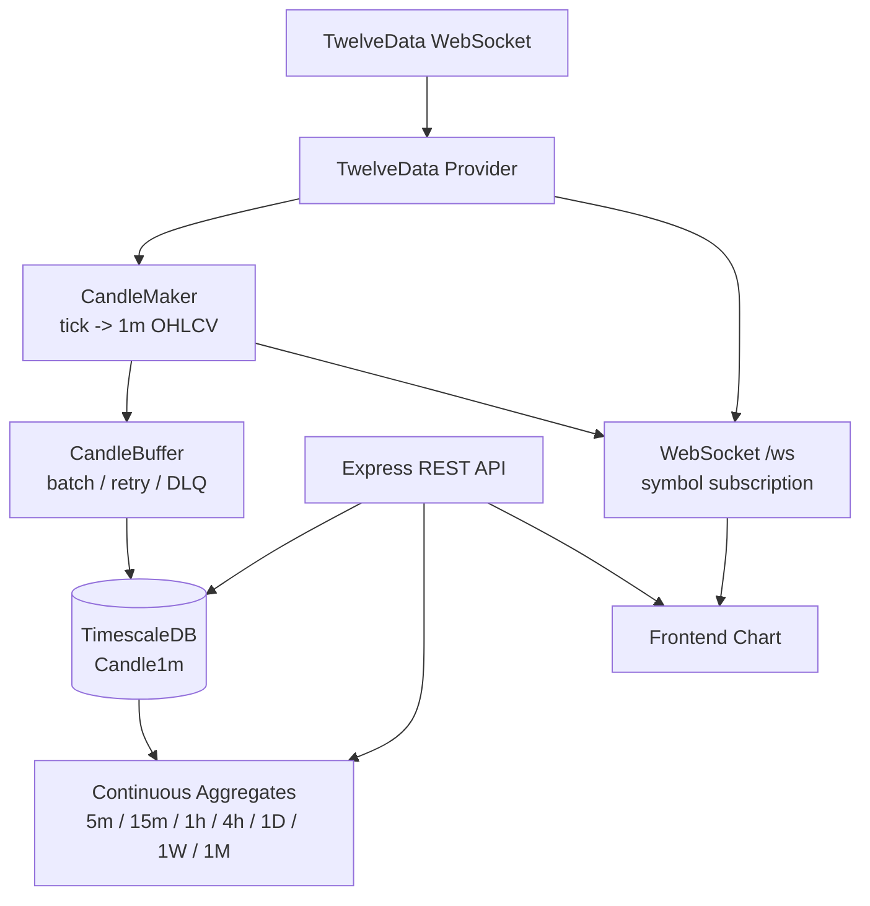

# Fin:D Chart Server

## Overview

TwelveData의 실시간 가격을 1분봉 OHLCV candle로 변환·저장하고, 프론트엔드 차트에 REST/WebSocket으로 제공하는 Node.js 서버입니다.

## Architecture



## Tech Stack

| 구분 | 기술 |
| --- | --- |
| Runtime | Node.js 22, TypeScript |
| Server | Express, ws |
| Database | PostgreSQL, TimescaleDB, Prisma |
| Data Source | TwelveData WebSocket/API |
| Quality | Vitest, strict typecheck, npm audit |
| Delivery | Multi-stage Docker, Docker Compose, GitHub Actions |

## Features

- TwelveData WebSocket 가격 수신과 reconnect
- tick 기반 1분봉 OHLCV 생성
- CandleBuffer batch flush, retry, Dead Letter 처리
- Continuous Aggregates 기반 다중 timeframe 조회
- Candle REST API와 client별 symbol 구독 WebSocket
- API validation과 `{ success, errorCode, message }` 실패 응답
- Local TimescaleDB 개발 환경과 destructive script guard

## Getting Started

```bash
npm install
cp .env.example .env
npm run db:up
npm run db:ps
npm run prisma:generate
npm run migrate:deploy
npm run dev
```

Continuous Aggregate SQL 적용과 `5432` 포트 충돌 대응은 [DB Setup](docs/DB_SETUP.md)을 참고하세요. `.env`와 실제 secret은 커밋하지 않습니다.

## Environment Variables

| 변수 | 설명 |
| --- | --- |
| `NODE_ENV` | `development`, `production`, `test` |
| `PORT` | HTTP/WebSocket port, 기본값 `8080` |
| `DATABASE_URL` | PostgreSQL/TimescaleDB 연결 URL |
| `TWELVE_DATA_API_KEY` | TwelveData API key |
| `STREAM_SYMBOLS` | upstream 구독 symbol 목록 |
| `USE_REDIS` | Redis Pub/Sub 사용 여부 |
| `REDIS_URL` | Redis 연결 URL |
| `CORS_ORIGIN` | 허용 origin 목록 |

## Local TimescaleDB

```bash
npm run db:up
npm run db:ps
npm run db:logs
npm run db:down
```

Local 기본 계정과 비밀번호는 개발 전용입니다. Prisma migration, Continuous Aggregate, seed/backfill, reset guard는 [DB Setup](docs/DB_SETUP.md)에 정리했습니다.

## REST API

주요 endpoint:

| Method | Path | 역할 |
| --- | --- | --- |
| `GET` | `/` | liveness |
| `GET` | `/health` | DB readiness |
| `GET` | `/api/candles/:symbol/:timeframe` | candle 조회 |
| `POST` | `/api/aggregate/refresh` | Continuous Aggregate refresh |

- 지원 timeframe: `1m`, `5m`, `15m`, `1h`, `4h`, `1D`, `1W`, `1M`
- `limit`: 정수 `1~5000`, 기본값 `1000`
- `BTC/USD` path 요청: `/api/candles/BTC%2FUSD/1m`
- 실패 응답: `{ success, errorCode, message }`

등록된 전체 endpoint는 [API Documentation](docs/API_DOCUMENTATION.md)을 참고하세요.

## WebSocket Protocol

Endpoint: `/ws`

- 연결 직후 `welcome`을 받고 기본 구독은 비어 있습니다.
- `subscribe` 이후 해당 symbol의 `tick`과 `candle`만 수신합니다.
- `unsubscribe`로 symbol 수신을 중단합니다.
- ping/pong heartbeat에 응답하지 않는 client는 정리됩니다.
- `BTC/USD`는 WebSocket JSON에서 URL encoding하지 않습니다.

```json
{ "type": "subscribe", "symbols": ["AAPL", "BTC/USD"] }
```

```json
{ "type": "unsubscribe", "symbols": ["AAPL"] }
```

상세 메시지와 오류 형식은 [API Documentation](docs/API_DOCUMENTATION.md#websocket)을 참고하세요.

## Database / TimescaleDB

애플리케이션은 `Candle1m`을 원천 데이터로 저장합니다. `5m` 이상의 candle은 TimescaleDB Continuous Aggregates가 생성하며 Chart Server는 view를 조회합니다.

- [DB Setup](docs/DB_SETUP.md)
- [Prisma schema](prisma/schema.prisma)
- [Continuous Aggregate SQL](prisma/migrations/continuous_aggregates.sql)

## Test / Typecheck / Build

```bash
npm test
npm run typecheck
npm run build
npm audit
npm audit --omit=dev
```

현재 검증 결과:

- 6 test files, 63 tests passed
- TypeScript strict typecheck passed
- TypeScript production build passed
- 전체/production dependency audit 0 vulnerabilities

## Docker

```bash
docker build -t find-chart-server:local .
```

Production image는 multi-stage build로 생성되며 non-root 사용자로 `node dist/server.js`를 실행합니다. Runtime 환경변수와 secret은 실행 환경에서 주입합니다. 자세한 내용은 [Docker](docs/DOCKER.md)를 참고하세요.

## CI

`find-chart_T/**` 변경 시 GitHub Actions가 다음 항목을 검증합니다.

- `npm ci`, Prisma Client generate
- `npm audit`, `npm audit --omit=dev`
- `npm test`, `npm run typecheck`, `npm run build`
- production Docker image build

CI는 placeholder 환경변수만 사용하며 실제 RDS나 운영 secret에 연결하지 않습니다.

## Current Limitations

- TwelveData upstream 구독 symbol은 `STREAM_SYMBOLS` 정적 설정 기반입니다.
- 장시간 운영용 metrics, tracing, alerting은 별도 보강이 필요합니다.
- Redis 기반 multi-instance Pub/Sub은 실제 운영 환경 검증이 필요합니다.

## Documentation

- [API Documentation](docs/API_DOCUMENTATION.md)
- [DB Setup](docs/DB_SETUP.md)
- [Dependency Audit](docs/DEPENDENCY_AUDIT.md)
- [Docker](docs/DOCKER.md)
- [Contribution](../docs/chart/CONTRIBUTION.md)
