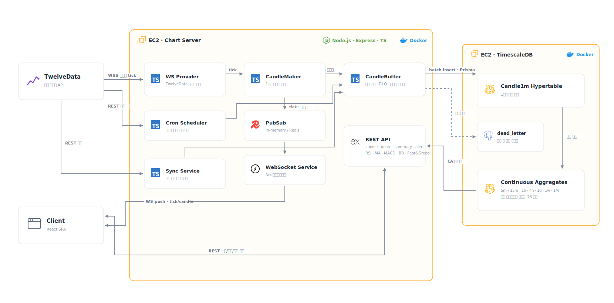

# Fin:D Chart Server

## 개요

TwelveData의 실시간 가격을 1분봉 OHLCV 캔들로 변환·저장하고, 프론트엔드 차트에 REST/WebSocket으로 제공하는 Node.js 서버입니다.

## 아키텍처



## 기술 스택

| 구분 | 기술 |
| --- | --- |
| 실행 환경 | Node.js 22, TypeScript |
| 서버 | Express, ws |
| 데이터베이스 | PostgreSQL, TimescaleDB, Prisma |
| 데이터 소스 | TwelveData WebSocket/API |
| 품질 검증 | Vitest, strict mode 타입 검사, npm 보안 검사 |
| 배포 | 다단계 Docker, Docker Compose, GitHub Actions |

## 주요 기능

- TwelveData WebSocket 가격 수신과 재연결
- 틱 기반 1분봉 OHLCV 생성
- CandleBuffer 일괄 저장, 재시도, Dead Letter 처리
- Continuous Aggregates 기반 다중 시간 단위 조회
- 캔들 REST API와 클라이언트별 종목 구독 WebSocket
- API 입력값 검증과 `{ success, errorCode, message }` 실패 응답
- 로컬 TimescaleDB 개발 환경과 파괴적 스크립트 안전장치

## 시작하기

```bash
npm install
cp .env.example .env
npm run db:up
npm run db:ps
npm run prisma:generate
npm run migrate:deploy
npm run dev
```

Continuous Aggregate SQL 적용과 `5432` 포트 충돌 대응은 [DB 설정](docs/DB_SETUP.md)을 참고하세요. `.env`와 실제 비밀 값은 커밋하지 않습니다.

## 환경 변수

| 변수 | 설명 |
| --- | --- |
| `NODE_ENV` | `development`, `production`, `test` |
| `PORT` | HTTP/WebSocket 포트, 기본값 `8080` |
| `DATABASE_URL` | PostgreSQL/TimescaleDB 연결 URL |
| `TWELVE_DATA_API_KEY` | TwelveData API 키 |
| `STREAM_SYMBOLS` | 상류 데이터 구독 종목 목록 |
| `USE_REDIS` | Redis Pub/Sub 사용 여부 |
| `REDIS_URL` | Redis 연결 URL |
| `CORS_ORIGIN` | 허용 출처 목록 |

## 로컬 TimescaleDB

```bash
npm run db:up
npm run db:ps
npm run db:logs
npm run db:down
```

로컬 기본 계정과 비밀번호는 개발 전용입니다. Prisma migration, Continuous Aggregate, 초기 데이터·백필, 초기화 안전장치는 [DB 설정](docs/DB_SETUP.md)에 정리했습니다.

## REST API

주요 엔드포인트:

| 메서드 | 경로 | 역할 |
| --- | --- | --- |
| `GET` | `/` | 서버 생존 상태 확인 |
| `GET` | `/health` | DB 준비 상태 확인 |
| `GET` | `/api/candles/:symbol/:timeframe` | 캔들 조회 |
| `POST` | `/api/aggregate/refresh` | Continuous Aggregate 새로고침 |

- 지원 시간 단위: `1m`, `5m`, `15m`, `1h`, `4h`, `1D`, `1W`, `1M`
- `limit`: 정수 `1~5000`, 기본값 `1000`
- `BTC/USD` 경로 요청: `/api/candles/BTC%2FUSD/1m`
- 실패 응답: `{ success, errorCode, message }`

등록된 전체 엔드포인트는 [API 문서](docs/API_DOCUMENTATION.md)를 참고하세요.

## WebSocket 프로토콜

엔드포인트: `/ws`

- 연결 직후 `welcome`을 받고 기본 구독은 비어 있습니다.
- `subscribe` 이후 해당 종목의 `tick`과 `candle`만 수신합니다.
- `unsubscribe`로 종목 수신을 중단합니다.
- ping/pong heartbeat에 응답하지 않는 클라이언트는 정리됩니다.
- `BTC/USD`는 WebSocket JSON에서 URL 인코딩하지 않습니다.

```json
{ "type": "subscribe", "symbols": ["AAPL", "BTC/USD"] }
```

```json
{ "type": "unsubscribe", "symbols": ["AAPL"] }
```

상세 메시지와 오류 형식은 [API 문서](docs/API_DOCUMENTATION.md#websocket)을 참고하세요.

## 데이터베이스 / TimescaleDB

애플리케이션은 `Candle1m`을 원천 데이터로 저장합니다. `5m` 이상의 캔들은 TimescaleDB Continuous Aggregates가 생성하며 Chart Server는 뷰를 조회합니다.

- [DB 설정](docs/DB_SETUP.md)
- [Prisma schema](prisma/schema.prisma)
- [Continuous Aggregate SQL](prisma/migrations/continuous_aggregates.sql)

## 테스트 / 타입 검사 / 빌드

```bash
npm test
npm run typecheck
npm run build
npm audit
npm audit --omit=dev
```

현재 검증 결과:

- 테스트 파일 6개, 테스트 63개 통과
- TypeScript strict mode 타입 검사 통과
- TypeScript 운영 빌드 통과
- 전체 및 운영 의존성 취약점 0건

## Docker

```bash
docker build -t find-chart-server:local .
```

운영 이미지는 다단계 빌드로 생성되며 비루트 사용자로 `node dist/server.js`를 실행합니다. 실행 환경 변수와 비밀 값은 실행 시 주입합니다. 자세한 내용은 [Docker](docs/DOCKER.md)를 참고하세요.

## CI

`find-chart_T/**` 변경 시 GitHub Actions가 다음 항목을 검증합니다.

- `npm ci`, Prisma Client 생성
- `npm audit`, `npm audit --omit=dev`
- `npm test`, `npm run typecheck`, `npm run build`
- 운영 Docker 이미지 빌드

CI는 대체 환경 변수만 사용하며 실제 RDS나 운영 비밀 값에 연결하지 않습니다.

## 현재 한계

- TwelveData 상류 구독 종목은 `STREAM_SYMBOLS` 정적 설정 기반입니다.
- 장시간 운영용 메트릭, 추적, 알림은 별도 보강이 필요합니다.
- Redis 기반 다중 인스턴스 Pub/Sub은 실제 운영 환경 검증이 필요합니다.

## 관련 문서

- [API 문서](docs/API_DOCUMENTATION.md)
- [DB 설정](docs/DB_SETUP.md)
- [의존성 보안 검사](docs/DEPENDENCY_AUDIT.md)
- [Docker](docs/DOCKER.md)
- [담당 기여](../docs/chart/CONTRIBUTION.md)
