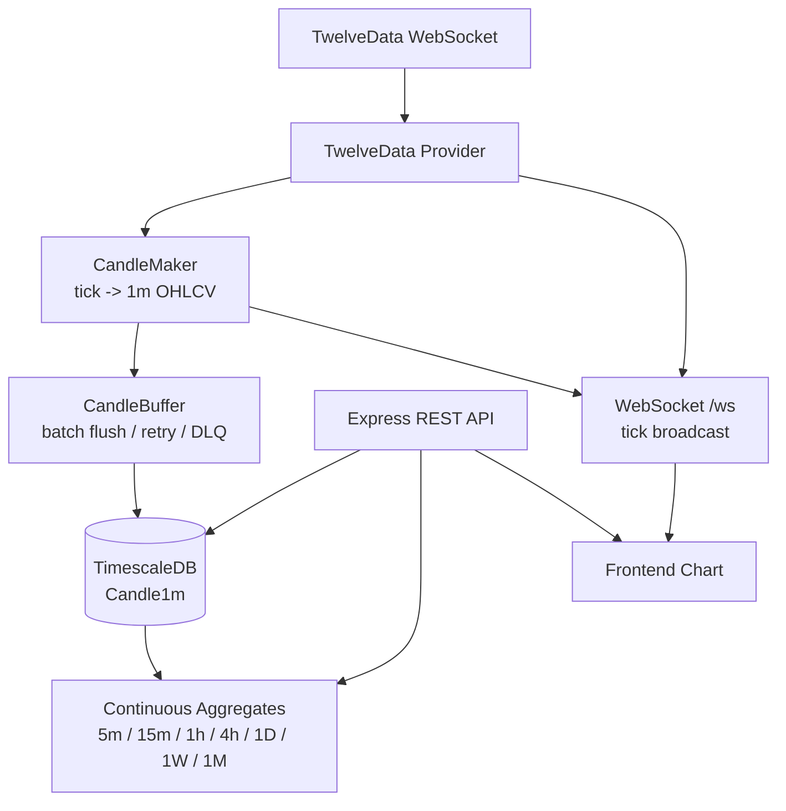

# Fin:D Chart Server

실시간 시장 가격 데이터를 수신해 캔들 데이터로 저장하고, 프론트엔드 차트에 REST/WebSocket으로 제공하는 서버입니다.

## 역할

- TwelveData WebSocket 가격 수신
- 1분봉 OHLCV 생성
- TimescaleDB 저장
- Continuous Aggregates 기반 상위 타임프레임 조회
- REST API 캔들 조회
- WebSocket 실시간 tick/candle 브로드캐스트

## Architecture



## Tech Stack

| 구분 | 기술 |
| --- | --- |
| Runtime | Node.js, TypeScript |
| Server | Express, ws |
| Database | PostgreSQL, TimescaleDB, Prisma |
| Data Source | TwelveData WebSocket/API |
| Infra | Docker, docker-compose |
| Utility | axios, envalid, winston, node-cron |

## Getting Started

```bash
npm install
cp .env.example .env
npm run prisma:generate
npm run migrate:deploy
npm run dev
```

TimescaleDB Continuous Aggregates는 `prisma/migrations/continuous_aggregates.sql`에 정리되어 있습니다. 백필이나 초기 데이터 적재 후에는 필요에 따라 해당 SQL 또는 `POST /api/aggregate/refresh`를 사용해 집계 뷰를 갱신합니다.

### Test

```bash
npm test
npm run typecheck
```

## Environment Variables

| 변수 | 설명 |
| --- | --- |
| `NODE_ENV` | `development`, `production`, `test` |
| `PORT` | HTTP/WebSocket 서버 포트, 기본값 `8080` |
| `DATABASE_URL` | PostgreSQL/TimescaleDB 연결 URL |
| `TWELVE_DATA_API_KEY` | TwelveData API Key |
| `USE_REDIS` | Redis Pub/Sub 사용 여부, 기본값 `false` |
| `REDIS_URL` | Redis 연결 URL |
| `STREAM_SYMBOLS` | TwelveData WebSocket 구독 심볼 목록 |
| `CORS_ORIGIN` | 허용할 Origin 목록 |

## API

| Method | Path | 설명 |
| --- | --- | --- |
| `GET` | `/` | 서버 기본 상태 확인 |
| `GET` | `/health` | DB 연결을 포함한 readiness 확인 |
| `GET` | `/api/candles/:symbol/:timeframe` | 캔들 조회. `limit`, `from`, `to` query 지원 |
| `POST` | `/api/aggregate/refresh` | TimescaleDB Continuous Aggregate 수동 갱신 |
| `GET` | `/api/analysis/...` | 기술적 지표, 성과, 계절성, Fear & Greed 조회 |
| `GET` | `/api/summary` | 여러 심볼 요약 조회 |
| `GET` | `/api/summary/:symbol` | 단일 심볼 요약 조회 |
| `GET` | `/api/quotes/...` | 최신 시세, 티커, 카테고리별 시세 조회 |
| `GET/POST/PATCH/DELETE` | `/api/users` | 사용자 데이터 CRUD |

지원 타임프레임은 `1m`, `5m`, `15m`, `1h`, `4h`, `1D`, `1W`, `1M`입니다.

## WebSocket

- endpoint: `/ws`
- server message type: `tick`, `candle`
- `tick`: TwelveData 실시간 가격 수신 시 브로드캐스트
- `candle`: 1분봉 완성 시 브로드캐스트
- 현재는 연결된 클라이언트 전체 브로드캐스트 중심입니다.
- 심볼별 구독/해제 프로토콜은 개선 예정입니다.

예시:

```json
{ "type": "tick", "symbol": "BTC/USD", "price": 100.12, "timestamp": 1731400000 }
```

```json
{
  "type": "candle",
  "timeframe": "1m",
  "candle": {
    "symbol": "BTC/USD",
    "startTime": 1731400000,
    "open": 100,
    "high": 101,
    "low": 99,
    "close": 100.5,
    "volume": 0
  }
}
```

## 서버 구조

| 경로 | 역할 |
| --- | --- |
| `src/server.ts` | HTTP 서버 생성, WebSocket 초기화, TwelveData 연결, 스케줄러 시작 |
| `src/app.ts` | Express 앱, middleware, health check, `/api` 라우팅 |
| `src/modules/realtime/` | TwelveData provider, WebSocket broadcast, Pub/Sub |
| `src/modules/candle/` | CandleMaker, CandleBuffer, 캔들 조회/집계 API |
| `src/modules/analysis/` | 기술적 지표 및 시장 지표 API |
| `src/modules/summary/` | 심볼 요약 API |
| `src/modules/quote/` | 최신 시세 API |
| `prisma/schema.prisma` | `Candle1m`, `DeadLetter`, `User`, `Alert` 모델 |
| `prisma/migrations/continuous_aggregates.sql` | TimescaleDB Continuous Aggregates 정의 |

## Current Limitations

- CandleMaker, timeframe 유틸, CandleBuffer, 핵심 API의 테스트 기반을 구축했습니다.
- WebSocket 심볼별 구독/해제 프로토콜은 아직 구현되지 않았습니다.
- Dockerfile은 프로덕션 빌드 최적화가 필요합니다.
- DB migration과 TimescaleDB 초기화 SQL 정리가 필요합니다.
